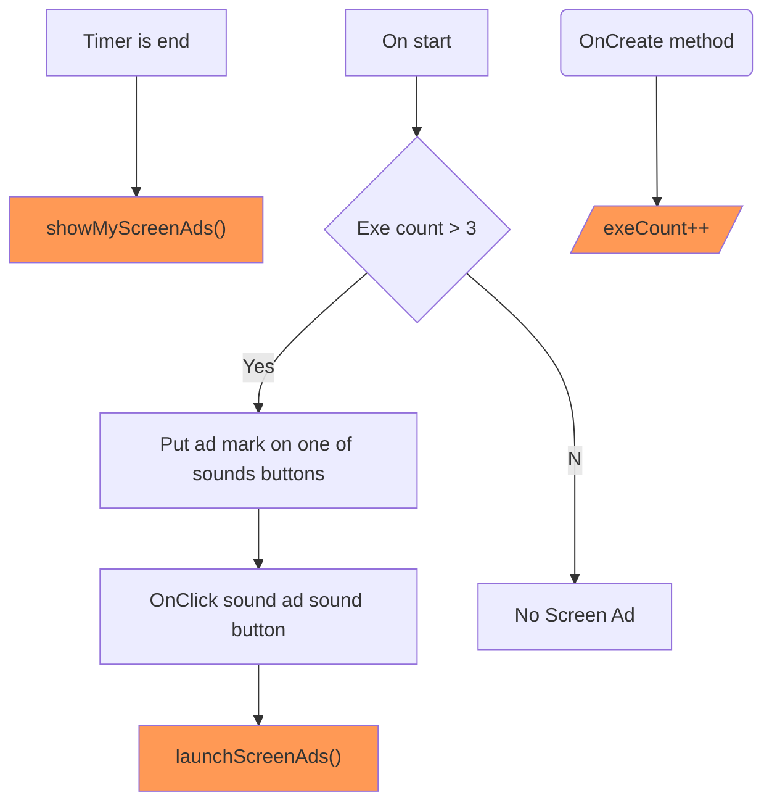

Nature meditation sound version 2
=================================
Restarted @2021-05-31
gitHub public 으로 설정해버렸네 ㅠㅠ

# Min SDK
Oreo level 26 ? 

# 목표
* 삭제되었던 App 들, 특히 『자연의 소리』 처럼 다운로드수가 많았던 앱은 우선 살린다.
* Copy-cat 을 여럿 만든다. 

# Notes
[오디오 포커스 개선사항](https://developer.android.com/about/versions/12/features/audio-focus-improvements?hl=ko)

## Media Player and Audio Focus
오디오 포커스를 획득하고 미디어 플레이어의 오디오 속성을 해당 오디오 포커스의 속성과 맞춰야 하는 것 같다.
```java

private void requestAudioFocus() {
    audioManager = (AudioManager) getSystemService(AUDIO_SERVICE);
    focusRequest = new AudioFocusRequest.Builder(AudioManager.AUDIOFOCUS_GAIN)
                            .setAudioAttributes(new AudioAttributes.Builder()
                            .setUsage(AudioAttributes.USAGE_MEDIA)
                            .setContentType(AudioAttributes.CONTENT_TYPE_MUSIC)
                            .build())
                        .build();
    int res = audioManager.requestAudioFocus(focusRequest);
    Log.d(tag, "Request audio focus : " + res);
}


private void initMediaPlayer() {
    requestAudioFocus();

    musicBoxIndex = new Random().nextInt(musicBoxIds.length - 1);
    Log.d(tag, "music box index = " + musicBoxIndex);

    mpMusicBox = MediaPlayer.create(getApplicationContext(), musicBoxIds[musicBoxIndex]);
    mpMusicBox.setAudioAttributes(
            new AudioAttributes.Builder()
                    .setContentType(AudioAttributes.CONTENT_TYPE_MUSIC)
                    .setUsage(AudioAttributes.USAGE_MEDIA)
                    .build());
    mpMusicBox.setOnCompletionListener(new MediaPlayer.OnCompletionListener() {
        @Override
        public void onCompletion(MediaPlayer mp) {
            mpMusicBox.release();
            playNextMusicBox();
        }
    });

    mpSounds = new ArrayList<>();
    for (int soundId : soundIds) {
        MediaPlayer mp = MediaPlayer.create(getApplicationContext(), soundId);
        mp.setAudioAttributes(
                new AudioAttributes.Builder()
                        .setContentType(AudioAttributes.CONTENT_TYPE_MUSIC)
                        .setUsage(AudioAttributes.USAGE_MEDIA)
                        .build());
        mp.setLooping(true);
        mpSounds.add(mp);
    }
}
```
# 전면 광고
